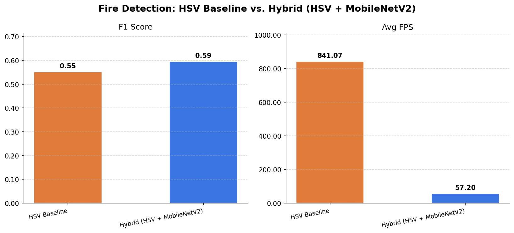

# Fire and Object Detection with Distance

A multi-component computer vision system for real-time fire detection and object recognition with depth sensing. Combines YOLOv3 object detection, Intel RealSense depth data, and a two-stage hybrid fire detector (HSV color filter + fine-tuned MobileNetV2 classifier).

---

## System Overview

```
┌─────────────────────────────────────────────────────────┐
│                    Live Camera Feed                      │
└────────────────────┬────────────────────────────────────┘
                     │
         ┌───────────┴───────────┐
         ▼                       ▼
┌─────────────────┐    ┌──────────────────────┐
│  YOLOv3 Object  │    │  Fire Detection       │
│  Detection      │    │  Pipeline             │
│  + RealSense    │    │                       │
│  Depth Sensing  │    │  Stage 1: HSV Filter  │
│                 │    │  Stage 2: MobileNetV2 │
└─────────────────┘    └──────────────────────┘
         │                       │
         └───────────┬───────────┘
                     ▼
           Annotated output frame
     (objects + distances + fire boxes)
```

---

## Repo Structure

```
├── yolo/
│   ├── yolo_object_detection.py   # YOLOv3 object detection
│   ├── yolov3.cfg                 # YOLOv3 network configuration
│   └── coco.names                 # COCO class labels (80 classes)
│
├── realsense/
│   └── realsense_depth.py         # Intel RealSense depth interface
│
├── distance/
│   └── detect_distance.py         # Camera-to-object distance calculation
│
├── fire_detection/
│   ├── legacy/
│   │   ├── fire1.py               # Original HSV fire detection script
│   │   └── updated_fire1.py       # Improved version of original script
│   │
│   ├── src/                       # Research pipeline (refactored + extended)
│   │   ├── hsv_detector.py        # Baseline: HSV color mask + motion gating
│   │   ├── hybrid_detector.py     # Two-stage: HSV pre-filter + MobileNetV2
│   │   ├── evaluate.py            # Evaluation: precision, recall, F1, FPS
│   │   ├── train_mobilenet.py     # Fine-tune MobileNetV2 on labeled frames
│   │   ├── extract_frames.py      # Extract training frames from labeled videos
│   │   └── label_frames.py        # Interactive frame labeling tool
│   │
│   ├── notebooks/
│   │   └── analysis.ipynb         # Results visualization
│   │
│   ├── data/
│   │   ├── sample_videos/         # Test videos (fire + hard negatives)
│   │   └── labels.json            # Per-frame ground truth labels
│   │
│   ├── models/
│   │   └── mobilenetv2_fire.keras # Fine-tuned MobileNetV2 classifier
│   │
│   └── results/
│       ├── metrics.csv            # Evaluation output
│       └── comparison_chart.png   # F1 and FPS comparison chart
│
└── requirements.txt
```

---

## Components

### 1. YOLOv3 Object Detection (`yolo/`)

Detects and classifies objects across 80 COCO categories in real time using YOLOv3.

> **Note:** `yolov3.weights` (236 MB) is not committed to this repo due to file size.
> Download from: https://pjreddie.com/media/files/yolov3.weights and place in `yolo/`.

```bash
python yolo/yolo_object_detection.py
```

### 2. RealSense Depth Sensing (`realsense/` + `distance/`)

Interfaces with an Intel RealSense camera to retrieve per-pixel depth data and compute real-world distances to detected objects.

```bash
python realsense/realsense_depth.py
python distance/detect_distance.py
```

### 3. Fire Detection Pipeline (`fire_detection/`)

#### Legacy scripts
The original rule-based fire detection scripts using HSV color masking:
```bash
python fire_detection/legacy/fire1.py
python fire_detection/legacy/updated_fire1.py
```

#### Research pipeline
A rigorously evaluated two-stage hybrid detector built on top of the legacy approach.

**Stage 1 — HSV baseline** (`src/hsv_detector.py`)
Detects fire using HSV color segmentation (orange-yellow hue range) combined with frame-to-frame motion gating to filter static warm-colored objects like lamps and sunlight.

**Stage 2 — Hybrid detector** (`src/hybrid_detector.py`)
Uses the HSV detector as a cheap pre-filter. Only invokes MobileNetV2 when the HSV pixel count crosses a threshold — reducing unnecessary inference calls on fire-free frames.

```
Frame → HSV filter → pixel_count < threshold? → SKIP (not fire)
                   ↓
             pixel_count ≥ threshold
                   ↓
         MobileNetV2 classifier → fire / no fire
```

---

## Results

Evaluated on 6,751 frames across 5 videos: 3 fire clips (indoor, outdoor, fireplace) and 2 hard negatives (sunset, nature).

| Detector | Precision | Recall | F1 | Avg FPS |
|---|---|---|---|---|
| HSV Baseline | 0.674 | 0.466 | 0.551 | 841.1 |
| Hybrid (HSV + MobileNetV2) | 0.576 | 0.614 | 0.595 | 57.2 |

The Hybrid detector improves F1 by **+8%** and recall by **+32%** over the HSV baseline — catching significantly more real fire. The FPS reduction reflects the HSV gate triggering frequently on fire-heavy footage; raising `hsv_gate_threshold` in `hybrid_detector.py` trades recall for speed.



---

## Setup

```bash
git clone https://github.com/nsethi23/Fire-and-Object-Detection-with-Distance.git
cd Fire-and-Object-Detection-with-Distance

python3 -m venv .venv
source .venv/bin/activate
pip install -r requirements.txt
```

Download YOLOv3 weights (not included due to size):
```bash
wget https://pjreddie.com/media/files/yolov3.weights -P yolo/
```

### Train the fire classifier from scratch

```bash
# Extract labeled frames from your videos
python fire_detection/src/extract_frames.py \
    --labels fire_detection/data/labels.json \
    --output frames/

# Fine-tune MobileNetV2 (requires TensorFlow)
python fire_detection/src/train_mobilenet.py --frames frames/

# Re-run evaluation
python fire_detection/src/evaluate.py \
    --videos fire_detection/data/sample_videos/ \
    --labels fire_detection/data/labels.json
```

---

## References

- Redmon & Farhadi, *YOLOv3: An Incremental Improvement* (2018)
- Howard et al., *MobileNets: Efficient CNNs for Mobile Vision Applications* (2017)
- Shamsoshoara et al., *FLAME Dataset: Aerial Imagery Pile Burn Detection* (2021)
- Intel RealSense SDK: https://github.com/IntelRealSense/librealsense

## License

This project is open-source and available under the MIT License.
